# Spirefysh V70 model architecture

Feature schema V55 · 800,628 trainable parameters · model width 64 · 4 attention heads × 16 · FFN width 128 · no dropout

```mermaid
flowchart TB
    subgraph OBS["1 · Ragged observation"]
        direction LR
        GAME["Batch of B game states<br/>character [B]: accepted but unused<br/>globals [B,0]: empty; supplies B"]
        DOM["16 typed domain tables<br/>row = U:uint32 + S:int32 + C:semantic IDs + F:float32<br/>state rows: scope &lt; 0<br/>candidate-owned rows: scope ≥ 0"]
        ACT["N represented action candidates<br/>U15 + S12 + C8 + F20 + legal flag<br/>ragged per state"]
        IDX["Structural indices<br/>state, owner, zone, order, scope,<br/>continuation tree, map DAG, menu object"]
        GAME --> DOM
        GAME --> ACT
        DOM --> IDX
        ACT --> IDX
    end

    subgraph TOKEN["2 · Shared tokenization"]
        direction LR
        EMB["Shared semantic embedding<br/>E: 3367 × 64; padding ID 0<br/>55 disjoint semantic namespaces<br/>215,488 parameters"]
        DENC["16 domain-specific SemanticEncoders<br/>cat = Σ(E[idⱼ] ⊙ field_gateⱼ) / √present<br/>token64 = ReLU(LayerNorm(cat + Linear(F→64) + bias))<br/>37,440 parameters"]
        AENC["Action SemanticEncoder<br/>C8 + F20 → base action64<br/>same shared embedding; separate field parameters<br/>1,984 parameters"]
        EMB --> DENC
        EMB --> AENC
    end

    DOM --> DENC
    ACT --> AENC
    IDX -.-> DENC

    subgraph STRUCT["3 · Specialized structure encoders"]
        direction LR
        CARD["CARD BRANCH<br/>5 zones: deck, hand, draw, discard, exhaust<br/><br/>start64 = learned zone64 + Linear(6 count features→64)<br/>sequence = start + card tokens<br/>layer 1: full pre-LN self-attention + FFN<br/>layer 2: start-query-only attention + FFN<br/>MHA 4×16; FFN 64→128→64<br/><br/>output: 5 × 64<br/>67,648 parameters"]
        ACTOR["ACTOR HIERARCHY<br/>history64 = pooled transformed history<br/>effects64 = pooled transformed power + status<br/>actor64 = ReLU(LN(Linear([actor ‖ history ‖ effects], 192→64)))<br/><br/>actors pooled as:<br/>party = player + optional Osty<br/>enemies = enemy actors<br/><br/>25,216 parameters"]
        ENTITY["PERMUTATION-INVARIANT POOLS<br/>vᵢ = ReLU(tuple_linear(tokenᵢ))<br/>s = Σvᵢ / √max(1,n)<br/>out64 = ReLU(pool_linear([s ‖ n/64 ‖ log1p(n)/5])<br/>+ learned collection state)<br/><br/>run, phase, party, enemies, relics, potions,<br/>orbs, events, encounters, crystal, continuation<br/>9,152 parameters"]
        CONT["CONTINUATION TREE<br/>bottom-up, deepest level first<br/>relation6 → Linear(no bias) → relation64<br/>message64 = ReLU(Linear([child64 ‖ relation64]))<br/>pool64 = Linear([Σmessage/√n ‖ count features])<br/>parent64′ = ReLU(LN(Linear([parent64 ‖ pool64])))<br/><br/>state roots → continuation summary<br/>candidate roots → candidate context<br/>21,312 parameters"]
        MAP["MAP DAG<br/>reverse-topological update at every level<br/>Q = Wq·LN(parent)<br/>K,V = Wkv·LN(child) + Wedge·edge<br/>u = parent + Wout·MHA(Q,K,V) + Wdegree·count features<br/>node′ = u + FFN(LN(u))<br/><br/>current node, or entry when absent, queries all map nodes<br/>encoded nodes also serve path candidates<br/>41,792 parameters"]
    end

    DENC --> CARD
    DENC --> ACTOR
    DENC --> ENTITY
    DENC --> CONT
    DENC --> MAP
    ACTOR --> ENTITY
    CONT --> ENTITY

    subgraph FUSION["4 · State and candidate fusion"]
        direction LR
        BASE["BASE STATE: 17 independently normalized blocks<br/><br/>5 card blocks:<br/>deck | hand | draw | discard | exhaust<br/><br/>11 entity blocks:<br/>run | phase | party | enemies | relics | potions | orbs<br/>events | encounters | crystal | continuation<br/><br/>1 map block: current map node<br/><br/>concat → base_state [B,1088]"]
        CAND["CANDIDATE CONTEXT<br/>start: base action64 + legal embedding; count = 1<br/>add all candidate-owned domain rows:<br/>(Σ token64) ⊙ domain_scale + domain_count × domain_bias<br/>add optional Linear(map path64)<br/>add optional Linear(target actor64)<br/><br/>action64 = ReLU(LN(Linear([base+legal ‖ pooled/√count<br/>‖ count/64 ‖ log1p(count)/5], 130→64)))<br/>18,880 parameters"]
    end

    CARD --> BASE
    ENTITY --> BASE
    MAP --> BASE
    DENC --> CAND
    AENC --> CAND
    ACTOR -->|"target actor"| CAND
    CONT -->|"candidate roots"| CAND
    MAP -->|"path node"| CAND

    subgraph MENU["5 · Action-set conditioning"]
        direction LR
        OBJECT["ACTION OBJECTS<br/>group target variants by<br/>(state, object ID U0, object type U14)<br/><br/>object64 = ReLU(Linear([mean(action64)<br/>‖ n/64 ‖ log1p(n)/5], 66→64))"]
        ATTN["MENU ATTENTION<br/>Q = Linear(base_state1088→64)<br/>K,V = Linear(objects64→128)<br/>4-head attention<br/>menu64 = LN(Linear(attended64)<br/>+ Linear(object-count features))<br/>empty menu = LN(learned empty64)<br/><br/>86,784 parameters"]
        STATE["FINAL STATE<br/>[base_state1088 ‖ menu64]<br/>state [B,1152]<br/>18 × 64 blocks"]
        OBJECT --> ATTN --> STATE
    end

    CAND --> OBJECT
    BASE --> ATTN
    BASE --> STATE

    subgraph HEADS["6 · Output heads"]
        direction LR
        POLICY["POLICY — per candidate<br/>[state1152 ‖ action64] = 1216<br/>Linear(1216→112) → ReLU → Linear(112→1)<br/>÷ temperature → illegal mask −∞<br/>ragged per-state log-softmax<br/><br/>output: log π(a|s), flat or padded [B,A]<br/>136,417 parameters"]
        CRITIC["CRITIC — per state<br/>Linear(1152→112) → ReLU → Linear(112→83)<br/><br/>softmax = terminal-progress distribution<br/>expected progress = E[class] / 82<br/>classes 0…72: non-win progress<br/>classes 73…81: never direct targets<br/>class 82: win<br/>138,515 parameters"]
    end

    STATE --> POLICY
    CAND --> POLICY
    STATE --> CRITIC

    subgraph CONTRACT["7 · Learning and deployment contract"]
        direction LR
        TRAIN["TRAINING<br/>policy: clipped PPO + entropy<br/>optional expert cross-entropy + winning replay<br/>critic: balanced 83-way cross-entropy<br/>λ-blended backward targets from frozen-policy critic<br/>optional MCTS parent/child consistency<br/>gradient norm ≤ 0.5 + post-update KL trust region"]
        EXPORT["EXPORT<br/>STSVALUE · model V70 · feature V55<br/>Rust ValueModel reproduces the forward graph<br/>STSACTOR suffix adds policy parameters<br/><br/>runtime win probability:<br/>σ((logit82 − logsumexp(logits0:82))/T + bias)"]
        TRAIN --> EXPORT
    end

    POLICY --> TRAIN
    CRITIC --> TRAIN

    classDef input fill:#e9f2ff,stroke:#3979c9,color:#142033;
    classDef encoder fill:#e7f8f3,stroke:#168d77,color:#142033;
    classDef structure fill:#f1ebff,stroke:#7958cf,color:#142033;
    classDef fusion fill:#fff2dc,stroke:#ca7a13,color:#142033;
    classDef head fill:#ffe9ec,stroke:#ce4d61,color:#142033;
    classDef contract fill:#f1f4f8,stroke:#8190a2,color:#142033;
    class GAME,DOM,ACT,IDX input;
    class EMB,DENC,AENC encoder;
    class CARD,ACTOR,ENTITY,CONT,MAP structure;
    class BASE,CAND,OBJECT,ATTN,STATE fusion;
    class POLICY,CRITIC head;
    class TRAIN,EXPORT contract;
```

## Exact input widths

`U` and `S` are structural/raw fields, `C` contains namespaced semantic IDs, and `F` contains normalized numeric features. Only `C` and `F` enter each `SemanticEncoder`; `U` and `S` construct the graph, groups, ownership, order, and candidate links.

| Domain | U | S | C | F | Domain | U | S | C | F |
|---|---:|---:|---:|---:|---|---:|---:|---:|---:|
| run | 24 | 16 | 6 | 36 | relic | 12 | 4 | 8 | 16 |
| phase | 16 | 8 | 12 | 16 | potion | 6 | 2 | 5 | 6 |
| card | 20 | 16 | 73 | 23 | orb | 6 | 2 | 5 | 6 |
| actor | 12 | 16 | 5 | 27 | event | 4 | 1 | 4 | 4 |
| power | 8 | 4 | 5 | 8 | encounter | 4 | 0 | 3 | 4 |
| history | 6 | 28 | 4 | 32 | crystal | 8 | 2 | 5 | 10 |
| status | 20 | 8 | 72 | 17 | continuation | 24 | 16 | 80 | 24 |
| map_node | 12 | 0 | 7 | 8 | map_edge | 8 | 0 | 2 | 4 |

Action candidates use `U15 + S12 + C8 + F20`.

## Parameter accounting

| Component | Parameters |
|---|---:|
| Shared semantic embedding | 215,488 |
| 16 domain encoders | 37,440 |
| Action encoder | 1,984 |
| Card branch | 67,648 |
| Actor branch | 25,216 |
| Entity pools | 9,152 |
| Map branch | 41,792 |
| Continuation branch | 21,312 |
| Candidate fusion | 18,880 |
| Action menu | 86,784 |
| Policy and critic heads | 274,932 |
| **Total** | **800,628** |

The model has no global vector, fusion transformer, dropout, or implicit positional embedding. Deduplication, padding, graph caching, and custom Metal ragged kernels change execution cost but not the mathematical graph.

Source of truth: `train.py::Agent`. Deployment mirror: `src/learning.rs::ValueModel`.
